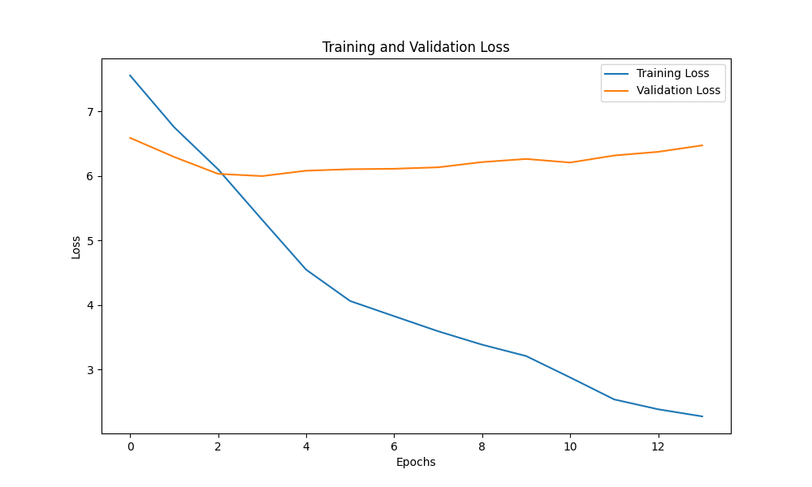

# English to Bodo Neural Machine Translation (NMT)

This project implements a **Neural Machine Translation (NMT)** system that translates English sentences into Bodo using an **attention-based Seq2Seq architecture**. The model addresses the challenges of **low-resource language translation**, focusing on Bodo—a Sino-Tibetan language spoken in Northeast India.

---

## 📌 Project Overview

- **Language Pair**: English ➝ Bodo  
- **Architecture**: Bidirectional GRU Encoder + GRU Decoder with Bahdanau Attention  
- **Framework**: PyTorch  
- **Corpus Domain**: Tourism and Health  
- **Dataset Size**: ~33,000 aligned sentence pairs  
- **BLEU-1 Score**: 14.64%

---

## 🧠 Model Architecture

- **Encoder**: Two-layer Bidirectional GRU  
- **Decoder**: Two-layer Unidirectional GRU  
- **Attention**: Additive (Bahdanau-style)  
- **Embedding**: Learned from scratch  
- **Loss Function**: Cross-Entropy Loss (ignores `<PAD>` tokens)  
- **Optimizer**: Adam (learning rate = 0.001)  
- **Training Enhancements**:  
  - Gradient Clipping  
  - Learning Rate Scheduler  
  - Early Stopping  
  - Teacher Forcing

---

## 🧪 Results

- **Training**: Conducted on GPU  
- **BLEU Scores**:
  - BLEU-1: 14.64
  - BLEU-2: 6.23
  - BLEU-3: 2.89
  - BLEU-4: 1.33



---

## 📁 Dataset

- **Source**: [Alayaran Parallel Dataset](https://get.alayaran.com/parallel-data/)
- **Splits**:
  - Training: 32,149 pairs
  - Validation: 665 pairs
  - Test: 444 pairs
- **Special Tokens**: `<SOS>`, `<EOS>`, `<PAD>`, `<UNK>`
- **Preprocessing**: Tokenization, Indexing, Padding, Vocabulary Building

---

## 🛠 Installation & Requirements

### 🔧 Prerequisites

- Python 3.8+
- pip (Python package manager)
- Git
- Jupyter Notebook
- A modern system with:
  - Minimum 8GB RAM
  - (Optional) NVIDIA GPU with CUDA support for faster training

---

### 📦 Python Dependencies

| Package       | Purpose                                |
|---------------|----------------------------------------|
| `torch`       | Building and training neural networks  |
| `torchtext`   | Text and vocabulary preprocessing      |
| `numpy`       | Numerical operations                   |
| `nltk`        | Tokenization and BLEU score calculation|
| `matplotlib`  | Visualization of training loss         |
| `pickle`      | Saving/loading tokenizers and models   |

---

### ✅ Setup Instructions

1. **Clone the repository**:
   ```bash
   git clone https://github.com/your-username/english-bodo-nmt.git
   cd english-bodo-nmt
