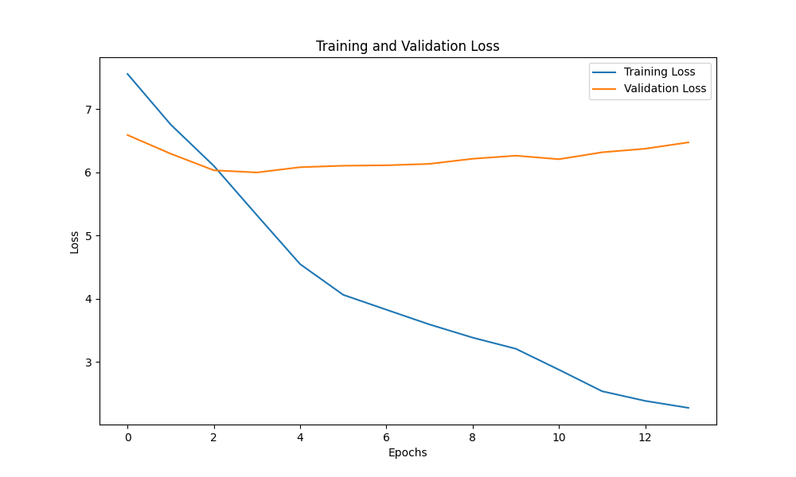

# English to Bodo Neural Machine Translation (NMT)

This project implements a **Neural Machine Translation (NMT)** system that translates English sentences into Bodo using an **attention-based Seq2Seq architecture**. It addresses the challenges of low-resource translation for the Bodo language using modern deep learning techniques.

---

## 📌 Project Overview

- **Language Pair**: English ➝ Bodo  
- **Architecture**: Bidirectional GRU Encoder + GRU Decoder with Bahdanau Attention  
- **Framework**: PyTorch  
- **Corpus Domain**: Tourism and Health  
- **Dataset Size**: ~33,000 sentence pairs  
- **BLEU-1 Score**: 14.64%

---

## 🧠 Model Architecture

- **Encoder**: 2-layer Bidirectional GRU  
- **Decoder**: 2-layer Unidirectional GRU  
- **Attention**: Bahdanau (Additive) Attention  
- **Loss Function**: Cross-Entropy (ignoring `<PAD>` tokens)  
- **Optimizer**: Adam (lr = 0.001)  
- **Techniques Used**:  
  - Gradient Clipping  
  - Learning Rate Scheduler  
  - Teacher Forcing  
  - Early Stopping

---

## 🧪 Results

- **Training/Validation Loss**: Stable convergence over 13 epochs
- **BLEU Scores**:
  - BLEU-1: 14.64
  - BLEU-2: 6.23
  - BLEU-3: 2.89
  - BLEU-4: 1.33



---

## 📁 Dataset

- **Source**: [Alayaran Parallel Corpus](https://get.alayaran.com/parallel-data/)
- **Content**: English–Bodo parallel data from tourism and health domains
- **Splits**:
  - Train: 32,149
  - Validation: 665
  - Test: 444

---

## 🛠 Installation & Setup

### 🔧 Prerequisites

- Python 3.8+
- Git
- Jupyter Notebook
- (Optional) GPU with CUDA for faster training

---

### 📦 Python Dependencies

| Package       | Purpose                                |
|---------------|----------------------------------------|
| `torch`       | Building and training neural models     |
| `torchtext`   | Text processing and vocabulary handling |
| `numpy`       | Numerical operations                    |
| `nltk`        | Tokenization, BLEU score                |
| `matplotlib`  | Plotting loss curves                    |
| `pickle`      | Saving/loading model and tokenizer      |

---

### ✅ Setup Options

#### 🧪 Option 1: Using Conda (Recommended)

If you have Anaconda or Miniconda installed:

```bash
conda env create -f environment.yml
conda activate english-bodo-nmt
jupyter notebook
```

---

#### 🧪 Option 2: Using pip

```bash
# Clone the repository
git clone https://github.com/your-username/english-bodo-nmt.git
cd english-bodo-nmt

# Create virtual environment
python -m venv venv
source venv/bin/activate  # On Windows use: venv\Scripts\activate

# Install dependencies
pip install torch torchtext numpy nltk matplotlib

# Download NLTK data
python -c "import nltk; nltk.download('punkt')"

# Run Jupyter
jupyter notebook
```

---

## 🚀 How to Use

- **Train model**: Run `model.ipynb`
- **Load & test**: Use `Model Load.ipynb` with `english_processor.pkl` and `bodo_processor.pkl`
- **Loss analysis**: See `loss_plot.png`

---

## 📈 Limitations & Future Work

- Limited training data lowers fluency for long sentences
- BLEU scores indicate word-level success but weak multi-word alignment

### 🔮 Planned Improvements

- Subword tokenization (Byte Pair Encoding)
- Use of pretrained models (e.g., mBART, mT5)
- Back-translation for data augmentation
- Human evaluation metrics
- Web/mobile deployment

---
